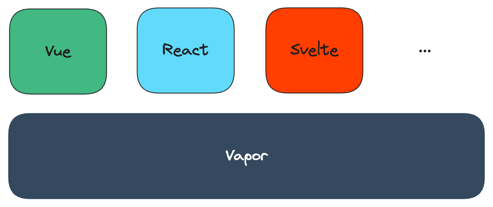

# Inclusion Vapor

This Research & Development project is for running various components in [vapor](https://github.com/vuejs/core-vapor).

This project started with my day job project and was inspired by [vue-jsx, which was announced at VueConf China 2024](https://x.com/OikawaRizumu/status/1808860605560074476).

> [!WARNING]
> This is WIP 👷, so don't use in production

This project try to work **whether interoperability can be provided between components of different frameworks on vapor**.



## 🚂 Current working status:

Currently, I’m working on svelte vapor, which is necessary for my day job, so that’s a priority.

- react-vapor (PoC Done): react for vapor
- svelte-vapor (PoC Done): svelte for vapor,

## 🍭 Playground

```sh
pnpm build # build the packages
pnpm play # start playground
```

## ⚛️ react-vapor

Based on React v18 latest

- [Jsx Vapor Explorer](https://jsx-vapor-explorer.netlify.app/)

## 🎩 svelte-vapor

Based on Svelte v4 (maybe v3 compatible)

- [Svelte Vapor Template Explorer](https://svelte-vapor-template-explorer.netlify.app)

## ✅ TODO

### react-vapor

<details>

- [ ] transform for jsx
  - [x] NodeTransform (Basic implementation done)
  - [x] DirectiveTransform (Basic implementation done)
- [ ] hooks
  - [ ] useActionState
  - [ ] useCallback
  - [ ] useContext
  - [ ] useDebugValue
  - [ ] useDefferdValue
  - [ ] useEffect
  - [ ] useId
  - [ ] useImperativeHandle
  - [ ] useInsertionEffect
  - [ ] useLayoutEffect
  - [ ] useMemo
  - [ ] useOptimistic
  - [ ] useReducer
  - [ ] useRef
  - [x] useState
  - [ ] useSyncExternalStore
  - [ ] useTransition
- [ ] Components
  - [ ] `<Fragments>`
  - [ ] `<Profiler>`
  - [ ] `<StrictMode>`
  - [ ] `<Suspense>`
  - [ ] Server components
- [ ] APIs
  - [ ] act
  - [ ] cache
  - [ ] createContext
  - [ ] forwardRef
  - [ ] lazy
  - [ ] memo
  - [ ] startTransition
  - [ ] use
  - [ ] experimental_taintObjectReference
  - [ ] experimental_taintUniqueValue
- [x] Template Explorer
- [ ] Vite plugin with unplugin (PoC done)
  - [ ] analysis dependencies
  - [ ] runtime transform
  - [ ] reactivity transform
- [x] Counter App
  - [x] simple bindings
  - [x] simple events
- [ ] Repl
- [ ] TODO-MVC App

</details>

### svelte-vapor

<details>

- [ ] transform
  - [x] NodeTransform (Basic implementation done)
  - [x] DirectiveTransform (Basic implementation done)
- [ ] Svelte Component
  - [x] prop
  - [x] attrs
  - [ ] prop export
  - [ ] `$$props`
  - [ ] `$$restProps`
  - [ ] `$`
  - [ ] `context="module"`
- [ ] Logic blocks
  - [x] `{#if}` / `{:else}` / `{:else if}`
  - [x] `{#each}`
  - [ ] `{#await}`
  - [ ] `{#key}`
- [ ] Special tags
  - [x] `{@html}`
  - [ ] `{@debug}`
  - [ ] `{@const}`
- [ ] Element directives
  - [x] `on:eventname`
  - [x] `bind:property`
  - [x] Binding `<select>` value
  - [ ] Media element bindings
  - [ ] Image element bindings
  - [ ] Block-level element bindings
  - [x] `bind:group`
  - [x] `bind:this`
  - [ ] `class:name`
  - [ ] `style:property`
  - [ ] `use:action`
  - [ ] `transition:fn`
  - [ ] Transition parameters
  - [ ] Custom transition functinos
  - [ ] Transition events
  - [ ] `in:fn/out:fn`
  - [ ] `animate:fn`
  - [ ] Animation Parameters
  - [ ] Custom animation functions
- [ ] Component directives
  - [x] `on:eventname`
  - [ ] `--style-props`
  - [x] `bind:property`
  - [x] `bind:this`
- [ ] Special elements
  - [ ] `<slot>`
    - [x] default (Basic implementation Done, `#each` and `#if is not implementaed yet)
    - [x] `<slot name="name">` (Basic implementation Done, `#each` and `#if is not implementaed yet)
    - [ ] `$$slots`
    - [ ] `<slot key={value}>`
  - [ ] `<svelte:self>`
  - [ ] `<svelte:component>`
  - [ ] `<svelte:element>`
  - [ ] `<svelte:window>`
  - [ ] `<svelte:document>`
  - [ ] `<svelte:body>`
  - [ ] `<svelte:head>`
  - [ ] `<svelte:options>`
  - [x] `<svelte:fragment>`
- [ ] Runtime
  - [ ] svelte
    - [ ] `onMount`
    - [ ] `beforeUpdate`
    - [ ] `afterUpdate`
    - [ ] `onDestroy`
    - [ ] `tick`
    - [ ] `setContext`
    - [ ] `getContext`
    - [ ] `hasContext`
    - [ ] `getAllContext`
    - [ ] `createEventDispatcher`
    - [ ] `Types`
  - [ ] store
  - [ ] motion
  - [ ] transition
  - [ ] animate
  - [ ] eashing
  - [ ] action
- [x] Template Explorer
- [ ] SFC-flavoured component compiler (PoC Done)
  - [ ] template
  - [ ] script
  - [ ] styles
- [ ] Vite plugin with unplugin (Poc Done)
  - [ ] analysis dependencies
  - [ ] runtime transform
  - [ ] reactivity transform
- [x] Counter App
  - [x] simple bindings
  - [x] simple events
- [ ] Repl
- [ ] TODO-MVC App

</details>

## 💖 Credits

This project is supported by:

- [Vue.js & Vapor](https://github.com/vuejs/core-vapor), created by [Evan You](https://github.com/yyx990803) and [Vapor team](https://github.com/orgs/vuejs/teams/vapor)
- [React](https://react.dev/), created by Meta Platforms, Inc, and affiliates.
- [Svelte](https://svelte.dev/), created by [Rich Harris](https://github.com/Rich-Harris) and Svelte community

And Inspired by:

- [unplugin-vue-jsx-vapor](https://github.com/unplugin/unplugin-vue-jsx-vapor), created by [zhiyuanzmj](https://github.com/zhiyuanzmj)
- [vue-hooks](https://github.com/Ubugeeei/vue-hooks), created by [Ubugeeei](https://github.com/Ubugeeei)

Thank you! ❤️

## ©️ License

[MIT](http://opensource.org/licenses/MIT)
